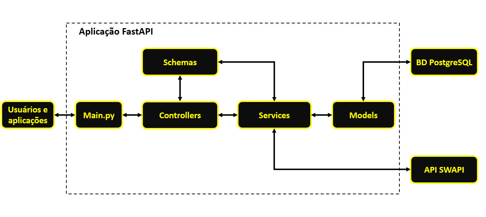

# Documentação Técnica do Projeto StarWars

## **Introdução**

O projeto StarWars é uma API RESTful desenvolvida em Python que utiliza a [SWAPI](https://swapi.dev/) como fonte de dados. O objetivo principal é fornecer uma API que permita aos usuários autenticados consultar informações sobre filmes, personagens, planetas, espécies, naves estelares e veículos da saga Star Wars.

### **Objetivos**

- **Construção da API RESTful**: desenvolver endpoints que permitam usuários consultar informações detalhadas sobre o Universo Star Wars, incluindo filmes, personagens, planetas, espécies, naves estelares e veículos.

- **Integração com a SWAPI**: utilizar a API externa SWAPI como fonte de dados para fornecer as informações sobre a saga.

- **Autenticação de usuários**: implementar uma estratégia de cadastro e login de usuários para acesso aos endpoints, protegidos, da aplicação.

- **Adoção de boas práticas**: seguir padrões de código, estruturação e clareza para facilitar a manutenção e escalabilidade.

- **Implementação de testes unitários**: garantir a qualidade e a confiabilidade da API através de testes unitários.

## **Infraestrutura da Solução**

A infraestrutura do projeto foi desenvolvida seguidos os princípios de separação de responsabilidades e modularização, utilizando AWS Lambda para aplicação, AWS API gateway, AWS Cognito, AWS ECR e AWS DynamoDB. 


A arquitetura do sistema foi projetada utilizando componentes da AWS para garantir escalabilidade, segurança e simplicidade. Abaixo, estão detalhados os componentes principais.

### **Componentes do Sistema**

#### **Aplicação FastAPI**
 A aplicação principal foi implementada com o framework FastAPI e funciona como um serviço serverless, utilizando o AWS Lambda.

 - **Empacotamento e Implantação**: A aplicação foi empacotada como uma imagem Docker baseada na imagem oficial do AWS Lambda para Python 3.10, garantindo compatibilidade com o ambiente de execução na AWS. A imagem gerada foi armazenada no AWS Elastic Container Registry (ECR), o que facilita o controle de versões e a atualização da aplicação, além de garantir a uniformidade do ambiente em diferentes implantações.

 - **Função Lambda**: O Lambda executa a lógica de negócios da API, incluindo a comunicação com a API externa SWAPI, o processamento dos dados brutos e o envio da resposta processada para os usuários.

 #### **Gateway de API**
O AWS API Gateway atua como um ponto de entrada para as requisições dos usuários. Ele é responsável por:

- Roteamento das requisições HTTP para a aplicação FastAPI hospedada no AWS Lambda.
- Autenticação e autorização das requisições utilizando o AWS Cognito.

No AWS API Gateway, as rotas são configuradas para utilizar o autorizador Cognito nos endpoints protegidos. Deslocando a responsabilidade de autenticação e autorização da aplicação para o API Gateway, simplificando a lógica de segurança no backend. O API Gateway integra-se diretamente ao AWS Cognito para validar tokens de acesso emitidos pelo serviço, garantindo que apenas usuários autenticados e autorizados possam acessar os recursos protegidos.

#### **Gerenciamento de Usuários**
O AWS Cognito é utilizado para gerenciar o fluxo de cadastro, login e autenticação de usuários, integrando-se com funções AWS Lambda para processamento de eventos acionados por triggers do Cognito. Ele fornece:

- **Página de login**: uma interface para que os usuários realizem o cadastro e login.

- **Autenticadores OAuth2 e OpenID Connect (OIDC)**: utilizado para gerar tokens de acesso (JWT) que autenticam as requisições aos endpoints protegidos.

- **Triggers Lambda**: Cognito aciona funções Lambda para personalizar o fluxo de cadastro de usuários e integração com o banco de dados DynamoDB.

#### **Banco de Dados**

O banco de dados AWS DynamoDB é utilizado para armazenar informações sobre os usuários cadastrados. A estrutura do banco de dados é mostrada a seguir:

- **Tabela users**:
    - **Estrutura**:
        - **user_id** (chave de partição): identificador único do usuário.
        - **confirmed**: booleano que indica se o usuário confirmou o email.
        - **created_at**: data e hora do registro do usuário.
        - **email**: email do usuário.

Os registros do banco de dados são inseridos/atualizados a partir do uso de função Lambda que interage com os eventos "PreSignUp" e "PostConfirmation" do Cognito, garantindo consistência entre os dados armazenados no Cognito e os dados armazenados no DynamoDB.

#### **Funções Lambda para Manipulação de Eventos do Cognito**

- **CognitoUserSyncHandler**:

    - Manipula os triggers "PreSignUp" e "PostConfirmation" do Cognito.

    - Realiza validações, registro de usuários e atualização de status de usuários no DynamoDB.

A função Lambda CognitoUserSyncHandler também foi empacotada como imagem Docker e armazenada no AWS ECR.

### **Fluxo Geral de Funcionamento do Sistema**

O sdiagrama mostrado abaixo ilustra o funcionamento do sistema quando o usuário possui o token de acesso JWT e realiza requisições para consumir a API.

[INSERIR O DIAGRAMA AQUI]

O funcionamento detalhado do sistema é descrito a seguir.

1. **Início da Requisição**

    O usuário envia uma requisição HTTP para acessar os recursos protegidos da API (representados pelo Lambda StarWarsApp).

    A requisição inclui um token JWT no cabeçalho *Authorization*, que foi previamente obtido apís o login no AWS Cognito.

2. **Processamento pelo AWS API Gateway**

    O API Gateway recebe a requisição e detecta que o recurso solicitado é protegido.

    O API Gateway utiliza um autorizador Cognito configurado para validar o token JWT fornecido.

    Ele verifica:

    - A assinatura do token JWT.
    - O tempo de expiração (exp).
    - O emissor (iss) e o público-alvo (aud) para garantir que o token seja válido para o pool de usuários Cognito configurado.

    Caso o token JWT seja válido, o fluxo prossegue; caso contrário, o API Gateway retorna um erro HTTP 401 (Unauthorized) ao usuário.

3. **Encaminhamento à Lambda**

    Após validar o token JWT, o A´PI Gateway encaminha a requisição para a função AWS Lambda (StarWarsApp), que é responsável pelo processamento da lógica do sistema.

    A Lambda:

    - Recebe a requisição e processa os dados enviados pelo usuário.

    - Com base nos parâmetros recebidos, faz requisições HTTP à API SWAPI para recuperar dados brutos.

4. **Comunicação com a API SWAPI**

    A Lambda (StarWarsApp) faz requisições à API SWAPI utilizando os parâmetros fornecidos pelo usuário.

    A SWAPI retorna os dados brutos relacionados à saga Star Wars para a Lambda.

5. **Processamento dos Dados pela Lambda**

    A função Lambda processa os dados brutos retornados pela SWAPI, aplicando lógica de transformação, filtro, etc., necessários para a aplicação.

    Após o processamento, a Lambda gera uma resposta no formato esperado pelo usuário.

6. **Retorno da Resposta ao Usuário**

    A Lambda retorna a resposta processada para o API Gateway.

    O API Gateway encaminha a resposta ao usuário, completando o ciclo da requisição.


### **Fluxo de Cadastro**

O diagrama ilustra o processo de cadastro de usuário no AWS Cognito com integração à função Lambda CognitoUserSyncHandler e ao banco de dados DynamoDB, detalhando as etapas de registro inicial e conformação de usuário.

[INSERIR DIAGRAMA AQUI]

O funcionamento do fluxo de cadastro é descrito abaixo:

#### **Registro Inicial**

1. **Acesso ao Cliente Cognito**

    O usuário acessa a interface do cliente Cognito para iniciar o processo de cadastro.

    O cliente Cognito é responsável por exibir a interface onde o usuário preenche os campos orbigatórios, como email e senha.

2. **Envio dos Dados de Cadastro**

    O usuário insere as informações (email e senha) e clica no botão "Sign Up".

    Essas informações são enviadas para o AWS Cognito.

3. **Trigger PreSignUp**

    O Cognito dispara o evento PreSignUp, acionando a função Lambda "CognitoUserSyncHandler".

    A função Lambda executa as seguintes ações:

    - Verifica no banco de dados DynamoDB (tabela 'users') se já existe um registro com o mesmo 'email' ou 'user_id'.

    - Se os dados forem únicos:

        - Registra o novo usuário no DynamoDB com os seguintes atributos:

            - user_id
            - email
            - confirmed: False
            - created_at
    - Caso os dados já existam, a Lambda retorna um erro, indicando que o email já está registrado. 

#### **Envio de Cógio de Confirmação**

Após a etapa de registro inicial bem-sucedida:

- O Cognito envia automaticamente um email de confirmação para o endereço de email fornecido pelo usuário.

- O email contém um código de confirmação necessário para confirmar a conta.

#### **Confirmação de Cadastro**

1. **Envio do Código de Confirmação**

    O usuário acessa novamente o cliente Cognito e insere o código de confirmação recebido por email.

    O cliente envia o código de confirmação para o Cognito.

2. **Trigger PostConfirmation**

    O Cognito dispara o evento PostConfirmation, acionando novamente a função Lambda CognitoUserSyncHandler.

    A função Lambda executa as seguintes ações:

    - Atualiza o registro do usuário no DynamoDB:

        - Modifica o atributo 'confirmed' de 'False' para 'True', indicando que o usuário confirmou sua conta.

#### **Finalização do Cdastro**

Após confirmação bem-sucedida, o usuário está devidamente cadastrado.

O usuário agora está apto a realizar login e acessar os recursos protegidos do sistema.


### **Fluxo de Login**

O diagrama apresentado descreve o processo de login de usuários utilizando o AWS COgnito com o fluxo de concessão implícita do OAuth 2.0. 

[INSERIR O DIAGRAMA AQUI]

#### **Acesso à Interface Cognito UI**

1. O usuário acessa a interface de login fornecida pelo cliente do AWS Cognito.

2. O usuário insere suas credenciais de email e senha.

#### **Autenticação no Cognito**

1. Após envio das credenciais:

    - O Cognito valida o email e senha fornecidos pelo usuário.

    - Essa validação ocorre dentro do pool de usuários configurado no Cognito.

    - Se as credenciais forem inválidas, o Cognito retorna um erro informando que o login não foi autorizado.

2. Se as credenciais forem válidas:

    - O cognito autentica o usuário e gera um token de acesso JWT.

#### **Redirecionamento para a URL de Retorno**

1. Após a autenticação bem-sucedida:

    -   O Cognito redireciona o usuário para a URL de retorno configurada no cliente Cognito.

    - A URL de retorno é um endpoint previamente registrado, como:

    ```
    https://example.com/callback
    ```

2. O redirecionamento inclui o token de acesso JWT como um parâmetro no fragmento da URL:

    ```
    https://example.com/callback#id_token=<TOKEN>&access_token=<TOKEN>&expires_in=3600&token_type=Bearer
    ```

#### **Uso do Token JWT**

1. O token de acesso JWT é extraído do fragmento da URL pelo cliente (navegador ou aplicação).

2. O token JWT pode ser usado para:

    - Autenticar o usuário em chamadas subsequentes para os endpoints protegidos da aplicação.

    - Ele é enviado no cabeçalho *Authorization* das requisições HTTP no formato:

    ```
    Authorization: <TOKEN>
    ```


### **Arquitetura da Aplicação FastAPI**



O diagrama acima ilustra a arquitetura interna da aplicação FastAPI, destacando a estrutura modular e o fluxo de dados entre os diferentes componentes. A aplicação segue um padrão de camadas que facilita a manutenção, escalabilidade e organização do código. Separando a lógica de negócio, controle de rotas e validação de dados.

A arquitetura apresenta os seguintes componentes:

- **Usuários e aplicações**:

    Representa os usuários e aplicações externas que interagem com a API.

- **Arquivo main.py**:

    Ponto de entrada da aplicação FastAPI. Responsável por iniciar a aplicação, definir as configurações iniciais, incluir rotas e gerenciar a execução geral da API.

    O arquivo recebe as requisições e direciona essas requisições para os controllers apropriados, dentro da camada "Controllers".

- **Controllers**:

    Gerencia as rotas da API e o mapeamento de endpoints. Cada endpoint é definido em um controller, onde são tratatos os métodos HTTP.

    Lida com as requisições recebidas, valida a entrada usando "Schemas" e chama os "Services" para executar a lógica de negócio.

- **Schemas**:

    Responsável pela definição e validação das estruturas de dados. Utilizando Pydantic, garantem que os dados recebidos pelas requisições estejam no formato correto e validam a resposta antes de ser enviada ao usuário.

- **Services**:

    Contém a lógica de negócio da aplicação. Processa as operações necessárias para atender a uma requisição e centraliza as regras de negócio.

De modo geral, a arquitetura apresenta os seguintes aspectos:

- **Modularidade**: cada camada tem uma responsabilidade específica, facilitando a manutenção e escalabilidade.

- **Separação de responsabilidades**: a lógica de negócios está isolada em Services, enquanto Controllers gerenciam as rotas e Schemas validam os dados de entrada e saída.

- **Facilidade de expansão**: novas funcionalidades podem ser adicionadas sem grandes alterações na estrutura.

## **Tecnologias Utilizadas**

- **Linguagem de programação**: Python

- **Framework web**: FastAPI.

- **Infraestrutura**: 

    - **AWS Lambda** 

    - **AWS API Gateway**
    
    - **AWS Elastic Container Registry (ECR)**
    
    - **AWS Cognito**
    
    - **AWS DynamoDB**

- **Contêinerização**: Docker.

- **Banco de dados**: AWS DynamoDB.

- **Teste**: Pytest.

- **Autenticação**: Token JWT (JSON Web Tokens).

- **Documentação automática**: Swagger UI.

### **Justificativas**

- **FastAPI**

    - Permite desenvolvimento rápido de APIs RESTful com alta performance.

    - Integração nativa com OpenAPI (Swagger) para geração automática de documentação.

- **AWS Lambda**

    - Solução serverless, eliminando a necessidade de gerenciar servidores.

    - Escala automaticamente com base no volume de requisições.

    - Integração direta com outros serviços AWS.

- **AWS API Gateway**

    - Garante gerenciamento simplificado de endpoints, roteamento de requisições e integração com Lambda.

    - Oferece suporte nativo à autenticação com AWS Cognito e validação de tokens JWT.

- **AWS Elastic Container Registry (ECR)**

    - Repositório seguro para armazenamento e gerencimaento de imagens Docker.

    - Integração direta com AWS Lambda para execução de funções baseadas em contêineres Docker.

- **AWS Cognito**

    - Fornece uma solução completa para gerenciamento de usuários e autenticação com suporte a OAuth 2.0.

    - Simplifica a implementação de login, registro e recuperação de senhas.

    - Gera tokens JWT para autorização segura em endpoints protegidos.

- **AWS DynamoDB**

    - Banco de dados NoSQL gerenciado, escalável e com alta disponibilidade.

    - Integração nativa com AWS Lambda para armazenamento de dados de usuários.

- **Contêinerização: Docker**

    - Permite empacotamento da aplicação com todas as dependências. garantindo consistência em diferentes ambientes.

    - Simplifica o deploy em AWS Lambda com suporte a imagens Docker.

    - Facilita a escalabilidade e portabilidade entre diferentes plataformas.


- **Pytest**

    - Framework de testes altamente utilizado na comunidade Python, com suporte a testes automatizados.

    - Fácil integração com CI/CD pipelines.

- **JWT**

    - Permite autenticação e autorização seguras e independentes de estado.

- **Swagger UI**

    - Geração automática de documentação interativa, facilitando o entendimento e teste dos endpoints.

    - Integrado nativamente com o FastAPI.

    - Permite a validação de requisições diretamente na interface.

## **Endpoints da API**

### **Tag: films**

Responsável pela consulta de informações sobre filmes.

- **\[GET\] /films**: retorna uma lista de todos os filmes.

- **\[GET\] /films/{film_id}**: retorna informações detalhadas de um filme específico.

- **\[GET\] /films/{film_id}/characters**: retorna informações sobre todos os personagens de um determinado filme, identificado pelo parâmetro {film_id}.

### **Tag: people**

Responsável pela consulta de informações sobre personagens.

- **\[GET\] /people**: retorna uma lista de todos os personagens.

- **\[GET\] /people/{people_id}**: retorna informações detalhadas de um personagem específico.

- **\[GET\] /people/{people_id}/vehicles**: retorna informações sobre todos os veículos associados a um personagem específico, identificado pelo parâmetro {people_id}.

### **Tag: planets**

Responsável pela consulta de informações sobre planetas.

- **\[GET\] /planets**: retorna uma lista de todos os planetas.

- **\[GET\] /planets/{planet_id}**: retorna informações detalhadas de um planeta específico.

- **\[GET\] /planets/{planet_id}/residents**: retorna informações detalhadas sobre todos os personagens que são residentes de um planeta específico, identificado pelo parâmetro {planet_id}.

### **Tag: species**

Responsável pela consulta de informações sobre espécies.

- **\[GET\] /species**: retorna uma lista de todos as espécies.

- **\[GET\] /species/{specie_id}**: retorna informações detalhadas de uma espécie específica.

- **\[GET\] /species/{specie_id}/people**: retorna informações detalhadas sobre todos os personagens que são de uma espécie específica, identificada pelo parâmetro {specie_id}.

- **\[GET\] /species/{specie_id}/films**: retorna informações detalhadas sobre os filmes em que uma espécie específica, identificada pelo parâmetro {specie_id}, está presente.

### **Tag: starships**

Responsável pela consulta de informações sobre naves estelares.

- **\[GET\] /starships**: retorna uma lista de todos as naves estelares.

- **\[GET\] /starships/{starship_id}**: retorna informações detalhadas de um filme específico.

- **\[GET\] /starships/{starship_id}/pilots**: retorna informações detalhadas sobre os pilotos de uma nave estelar específica, identificada pelo parâmetrom {starship_id}.

### **Tag: vehicles**

Responsável pela consulta de informações sobre veículos.

- **\[GET\] /vehicles**: retorna uma lista de todos os veículos.

- **\[GET\] /vehicles/{vehicle_id}**: retorna informações detalhadas de um veículo específico.

## **Testes Unitários**

Para garantir a qualidade do código, foram implementados testes unitários para a camada de "services", onde a lógica de negócios é processada. Foi utilizado o Pytest.

### **Estratégias de teste**

- **Mock da SWAPI**: foram criados mocks das respostas da SWAPI para testar os endpoints sem depender da conexão externa. Garantindo que os testes sejam isolados e independentes da disponibilidade da API externa.

## **Testar a aplicação localmente**

Siga os passados abaixo para configurar e executar a aplicação localmente.

### **Pré-requisitos**

- IDE (VSCode, por exemplo)

- Python 3.10 

- Git para clonar o repositório

- PostgreSQL (se desejar executar o banco de dados localmente)

### **Configuração**

- Clonar o repositório

Clone o repositório utilizando o comando abaixo:

```
git clone https://github.com/marioshenrique/starwars-project.git
cd StarWarsApp
```
- Criar o ambiente virtual 
```
python -m venv venv
```
- Ativar o ambiente virtual (Windows)
```
venv\Scripts\activate
```
- Ativar o ambiente virtual (Linux)
```
source venv/bin/activate
```
- Instalar as dependências
```
pip install -r requirements.txt
```
- Criar o banco de dados (caso não exista)
```
python -m src.create_db
```
- Configurar as variáveis de ambiente em um arquivo .env

```
API_BASE_URL - URL da API externa
```
```
DATABASE_URL - conexão com o banco de dados PostgreSQL
```
```
SECRET_KEY - chave secreta utilizada para geração e validação dos tokens JWT
```
```
ALGORITHM - algoritmo utilizado pelo JWT
```
```
ACCESS_TOKEN_EXPIRE_MINUTES: tempo de expiração do token JWT em minutos.
```
- Inicializar o servidor
```
uvicorn main:app --reload
```
- Acessar o Swagger UI
```
Abra o navegador e acesse: http://localhost:8000/docs
```
## **Testar a aplicação com Docker localmente**

Siga os passos abaixo para configurar e executar a aplicação localmente utilizando o Docker.

### **Pré-requisitos**

- Docker instalado na máquina.

- Git para clonar o repositório.

### **Configuração**

- Clonar o repositório:

Clone o repositório utilizando o comando abaixo:

```
git clone https://github.com/marioshenrique/starwars-project.git
cd StarWarsApp
```

- Criar o arquivo .env com as seguintes variáveis de ambiente:

```
API_BASE_URL - URL da API externa.
DATABASE_URL - Conexão com o banco de dados PostgreSQL.
SECRET_KEY - Chave secreta utilizada para tokens JWT.
ALGORITHM - Algoritmo utilizado para o JWT.
ACCESS_TOKEN_EXPIRE_MINUTES - Tempo de expiração do token JWT em minutos.
```

- Construir a imagem Docker:

Execute o comando abaixo para criar a imagem Docker:

```
sudo docker build -t starwars-project-image-ubuntu:v1 .
```

- Criar e executar o container:

crie e execute o container utilizando o comando:

```
sudo docker run --name starwars-ubuntu-1 -it -p 8080:80 starwars-project-image-ubuntu:v1
```

### **Testar**

Após a aexecução bem-sucedida do container, acesse a aplicação localmente no navegador:

```
http://localhost:8080/docs
```