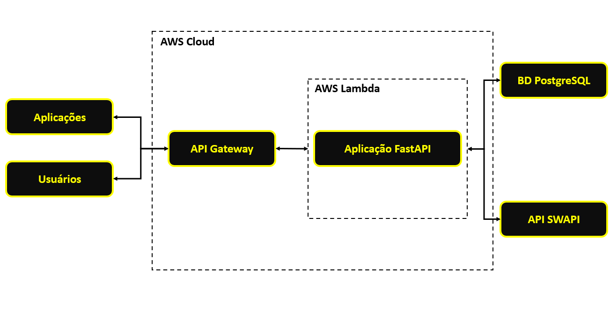
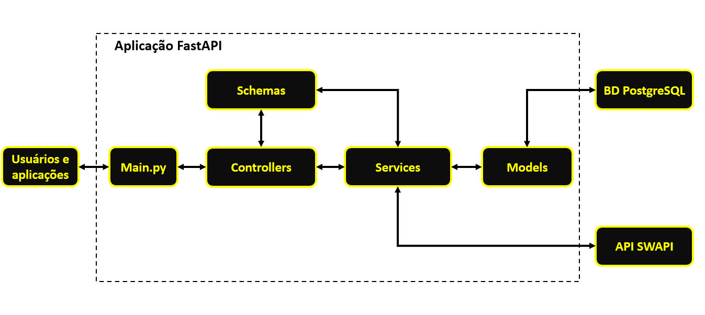

# Documentação Técnica do Projeto StarWars

## Introdução

O projeto StarWars é uma API RESTful desenvolvida em Python que utiliza a [SWAPI](https://swapi.dev/) como fonte de dados. O objetivo principal é fornecer uma plataforma que permita aos usuários autenticados consultar informações sobre filmes, personagens, planetas, espécies, naves estelares e veículos da saga Star Wars.

### Objetivos

- **Construção da API RESTful**: desenvolver endpoints que permitam usuários consultar informações detalhadas sobre o Universo Star Wars, incluindo filmes, personagens, planetas, espécies, naves estelares e veículos.

- **Integração com a SWAPI**: utilizar a SWAPI como fonte de dados para fornecer as informações sobre Star Wars.

- **Autenticação de usuários**: implementar registro e login de usuários, protegendo os endpoints de dados.

- **Adoção de boas práticas**: seguir padrões de código, estruturação e clareza para facilitar a manutenção e escalabilidade.

- **Implementação de testes unitários**: garantir a qualidade e a confiabilidade da API através de testes automatizados.

## Arquitetura da Solução

A arquitetura do projeto foi desenvolvida seguidos os princípios de separação de responsabilidades e modularização, utilizando AWS Lambda e API gateway para hospedagem serverless. 

### Arquitetura Geral



O diagrama acima apresenta a arquitetura geral do projeto. A aplicação é estruturada em uma arquitetura serverless, onde o processamento é feito utilizando o AWS Lambda, e a comunicação realizada pelo API Gateway.

A arquitetura apresenta os seguintes componentes:

- **Usuários e aplicações**:

    - **Usuários**: representa os usuários finais que acessam a API por meio de navegadores ou aplicativos móveis.

    - **Aplicações**: sistemas externos que consomem a API.

    Esses clientes fazem requisiçõies HTTP que são enviadas ao API Gateway para processamento.

- **API Gateway**:

    Atua como ponto de entrada da aplicação, recebendo as requisições. Neste projeto, a API Gateway tem como função principal o roteamento de requisições, direcionando cada requisição para a função Lambda que está executando a aplicação FastAPI.

    Após receber uma requisição, o API Gateway a envia para a aplicação FastAPAI no ambiente AWS Lambda.

- **AWS Lambda**:

    Ambiente serverless responsável pela execução da aplicação FastAPI.

- **Aplicação FastAPI**:

    Representa o núcleo da lógica de negócio do projeto, responsável por processar as requisições e fornecer respostas aos usuários e aplicações. Suas responsabilidades incluem:

    - Interação com o banco de dados PostgreSQL.

    - Integração com a API SWAPI.

- **Banco de dados PostgreSQL**:

    Utilizado para armazenar dados dos usuários.

- **API SWAPI**:

    A aplicação FastAPI faz requisições para SWAPI para obter informações sobre o universo Star Wars.


### Arquitetura da Aplicação FastAPI



O diagrama acima ilustra a arquitetura interna da aplicação FastAPI, destacando a estrutura modular e o fluxo de dados entre os diferentes componentes. A aplicação segue um padrão de camadas que facilita a manutenção, escalabilidade e organização do código. Separando a lógica de negócio, controle de rotas, validação de dados e acesso ao banco de dados.

A arquitetura apresenta os seguintes componentes:

- **Usuários e aplicações**:

    Representa os usuários e aplicações externas que interagem com a API.

- **Arquivo main.py**:

    Ponto de entrada da aplicação FastAPI. Responsável por iniciar a aplicação, definir as configurações iniciais, incluir rotas e gerenciar a execução geral da API.

    O arquivo recebe as requisições e direciona essas requisições para os controllers apropriados, dentro da camada "Controllers".

- **Controllers**:

    Gerencia as rotas da API e o mapeamento de endpoints. Cada endpoint é definido em um controller, onde são tratatos os métodos HTTP.

    Lida com as requisições recebidas, valida a entrada usando "Schemas" e chama os "Services" para executar a lógica de negócio.

- **Schemas**:

    Responsável pela definição e validação das estruturas de dados. Utilizando Pydantic, garantem que os dados recebidos pelas requisições estejam no formato correto e validam a resposta antes de ser enviada ao usuário.

- **Services**:

    Contém a lógica de negócio da aplicação. Processa as operações necessárias para atender a uma requisição e centraliza as regras de negócio.

- **Models**:

    Define a estrutura e a configuração das tabelas no banco de dados, utilizando ORM. Cada modelo representa uma tabela e seus campos, além das relações entre eles.

    Realiza operações de CRUD diretamente no banco de dados PostgreSQL.

De modo geral, a arquitetura apresenta os seguintes aspectos:

- **Modularidade**: cada camada tem uma responsabilidade específica, facilitando a manutenção e escalabilidade.

- **Separação de responsabilidades**: a lógica de negócios está isolada em Services, enquanto Controllers gerenciam as rotas, Schemas validam os dados e Models manipulam o banco de dados.

- **Facilidade de expansão**: novas funcionalidades podem ser adicionadas sem grandes alterações na estrutura.

## Tecnologias Utilizadas

- **Linguagem de programação**: Python

- **Framework web**: FastAPI.

- **Hospedagem em nuvem**: AWS Lambda e AWS API Gateway.

- **Bando de dados**: PostgreSQL.

- **ORM**: SQLAlchemy.

- **Teste**: Pytest.

- **Autenticação**: JWT (JSON Web Tokens).

- **Documentação automática**: Swagger UI e Redoc.

### Justificativas

- **FastAPI**: escolhido para a construção da API devido à sua alta performance e facilidade de criação de endpoints.

- **AWS Lambda e AWS API Gateway**: serviços serverless da AWS, que permitem escalabilidade automática e gerenciamento eficiente dos endpoints, além de eliminar a necessidade de manutenção de servidores.

- **PostgreSQL**: banco de dados relacional, utilizado para armazenar dados de usuários para autenticação.

- **SQLAlchemy**: adotado no projeto para permitir a interação com o banco de dados, garantindo uma camada de abstração que facilita as operações de CRUD a partir do mapeamento objeto-relacional.

- **Pytest**: framework de testes simples que facilita a escrita e manutenção de testes unitários.

- **JWT**: implementado para fornecer autenticação segura, assegurando que apenas usuários autenticados possam interagir com os recursos protegidos.

- **Swagger UI e Redoc**: fornece a documentação automática e interativa dos endpoints. Facilitando a compreensão e o consumo da API, permitindo testes diretos dos endpoints e visualização dos modelos de dados.

## Endpoints da API

### Tag: user

Responsável pela autenticação e registro de novos usuários no sistema.

 - **\[POST\] /user/register**: registra um novo usuário no sistema.

 - **\[POST\] /user/login**: autentica um usuário existente e retorna um token JWT com tempo de expieração de 30 minutos.

### Tag: films

Responsável pela consulta de informações sobre filmes.

- **\[GET\] /films**: retorna uma lista de todos os filmes.

- **\[GET\] /films/{film_id}**: retorna informações detalhadas de um filme específico.

### Tag: people

Responsável pela consulta de informações sobre personagens.

- **\[GET\] /people**: retorna uma lista de todos os personagens.

- **\[GET\] /people/{people_id}**: retorna informações detalhadas de um personagem específico.

### Tag: planets

Responsável pela consulta de informações sobre planetas.

- **\[GET\] /planets**: retorna uma lista de todos os planetas.

- **\[GET\] /planets/{planet_id}**: retorna informações detalhadas de um planeta específico.

### Tag: species

Responsável pela consulta de informações sobre espécies.

- **\[GET\] /species**: retorna uma lista de todos as espécies.

- **\[GET\] /species/{specie_id}**: retorna informações detalhadas de uma espécie específico.

### Tag: starships

Responsável pela consulta de informações sobre naves estelares.

- **\[GET\] /starships**: retorna uma lista de todos as naves estelares.

- **\[GET\] /starships/{starship_id}**: retorna informações detalhadas de um filme específico.

### Tag: vehicles

Responsável pela consulta de informações sobre veículos.

- **\[GET\] /vehicles**: retorna uma lista de todos os veículos.

- **\[GET\] /vehicles/{vehicle_id}**: retorna informações detalhadas de um veículo específico.

## Autenticação e Autorização

Foi implementado um sistema de autenticação baseado em JWT para proteger os endpoints da API. Apenas usuários autenticados podem acessados os dados da SWAPI através da API deste projeto.

- **Registro de usuário**: os usuários podem se registrar fornencendo um email e senha. A senha é armazenada no banco de dados como um hash seguro.

- **Login**: ao fazer login, o usuário recebe um token JWT válido por 30 minutos.

De maneira resumida, temos:

 - **Registro**: POST /user/register

 - **Login**: POST /user/login

 - **Acesso aos endpoints protegidos**: incluir o JWT no header "Authorization: Bearer \<token\>"

## Banco de Dados

### Modelo de dados

- **Tabela Users**:
    
    - **id**: UUID (chave primária)

    - **email**: string única (restrição de integridade)

    - **hashed_password**: string

    - **is_active**: booleano

### ORM com SQLAlchemy

As tabelas foram mapeadas para classes Python, facilitando as operações CRUD.

### Hospedagem

O banco de dados foi hospedado no servidor do [ElephantSQL](https://www.elephantsql.com/), que é um serviço na nuvem que oferece instâncias gerenciadas do PostgreSQL. Utilizado por desenvolvedoras para criação de bancos de dados em nuvem para testes de aplicações.

## Testes Unitários

Para garantir a qualidade do código, foram implementados testes unitários para a camada de "services", onde a lógica de negócios é processada. Foi utilizado o Pytest.

### Estratégias de teste

- Mock da SWAPI: foram criados mocks das respostas da SWAPI para testar os endpoints sem depender da conexão externa. Garantindo que os testes sejam isolados e independentes da disponibilidade da API externa.

- Banco de dados em memória: foi utilizado um banco de dados SQLite em memória para testar as operações de registro e login sem afetar o banco de dados de produção.

## Testar a aplicação localmente

Siga os passados abaixo para configurar e executar a aplicação localmente.

### Pré-requisitos

- Python 3.10 

- Git para clonar o repositório

- PostgreSQL (se desejar executar o banco de dados localmente)

### Configuração

- Clonar o repositório

Clone o repositório utilizando o comando abaixo:

```
git clone https://github.com/marioshenrique/starwars-project.git
cd starwars-root
```
- Criar o ambiente virtual 
```
python -m venv venv
```
- Ativar o ambiente virtual (Windows)
```
venv\Scripts\activate
```
- Ativar o ambiente virtual (Linux)
```
source venv/bin/activate
```
- Instalar as dependências
```
pip install -r requirements.txt
```
- Criar o banco de dados
```
python -m src.create_db
```
- Configurar as variáveis de ambiente

```
API_BASE_URL - URL da API externa
```
```
DATABASE_URL - conexão com o banco de dados PostgreSQL
```
```
SECRET_KEY - chave secreta utilizada para geração e validação dos tokens JWT
```
```
ALGORITHM - algoritmo utilizado pelo JWT
```
```
ACCESS_TOKEN_EXPIRE_MINUTES: tempo de expiração do token JWT em minutos.
```
- Inicializar o servidor
```
uvicorn src.main:app --reload
```
- Acessar o Swagger UI
```
Abra o navegador e acesse: http://localhost:8000/docs
```

